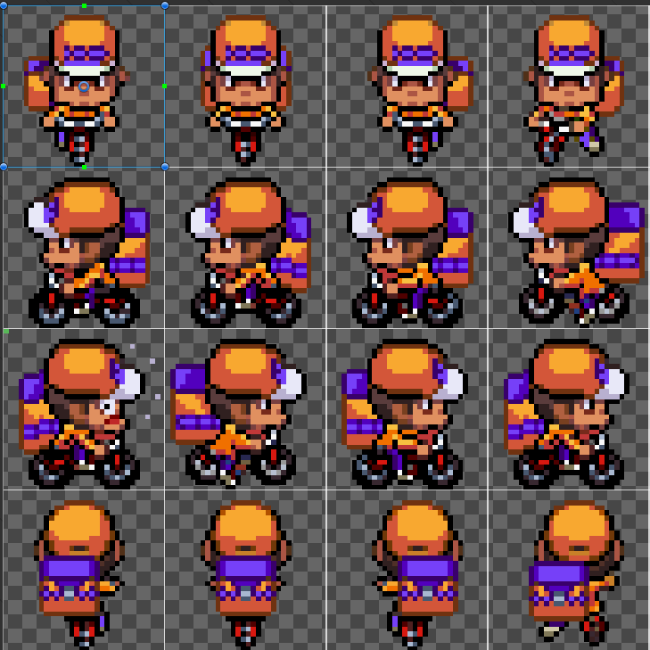
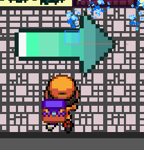
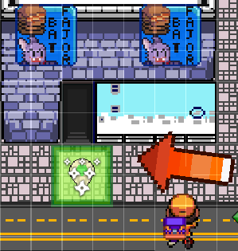
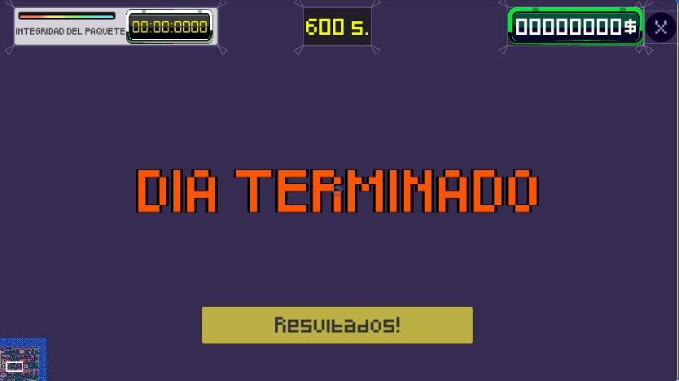
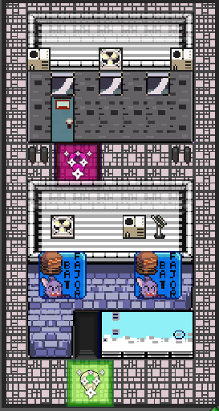
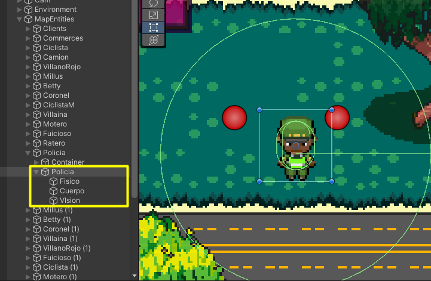

# PEC Final - Courier Mayhem

## ¿Cómo Jugar?

Vive la (infernal) experiencia de un repartidor de pedidos a domicilio que debe hacer entregas en tiempos record y evitar las multiples amenazas que se le encuentran por el camino para que lo que hayan pedido el cliente se preserve en el mejor estado posible. La satisfacción del cliente primero para obtener propinas.

Con las flechas direccionales moveremos al heroe de repartos, mientras evita chocar con todo tipo de transeuntes, vehiculos y seres vernáculos con exceso de calle. Puntua tanto como puedas antes que el tiempo de juego se acabe.

## Estructura Lógica del Proyecto

Para el control de la escena del juego plataforma, se ha hecho una aproximación tratando de mantener las responsabilidades entre
componentes lo más separadas posibles, mientras que se mantiene la forma de interactuar entre dichos componentes. Los más relevantes son:

- MainInputManager: Desacopla el manejo de inputs y permite eventualmente utilizarlo cono puente para otro tipo de entradas.

- Player: En este script se definen los elementos propiamente del personaje controlable, incluyendo sus hitboxes, colisions, triggers y animaciones, así como las interacciones que tiene con el resto del mundo de juego, Dentro de esta logica tambien tendrá un control especial para rotar al personaje teniendo en cuenta que se trata de un juego con vista cenital y requiere más operaciones para moverse en las 4 direcciones posibles.

- TargetPointer: Define el comportamiento de la Flecha brujula de calor del jugador que le indica a dónde debe dirigirse. Cada que hay un cambio de objetivo, la flecha se tornará "Fría" y apuntará a donde hay que ir. A medida que el jugador se acerque a la posición destino, la flecha se irá tornando "Caliente". (El cambio es logrado a través de operar sobre la Matiz/Hue del Shader del sprite basando el cambio con la proximidad del objetivo)

- Cinemachine: Utilizando el Cinemachine2D provisto por Unity (https://unity.com/unity/features/editor/art-and-design/cinemachine), se permite cambiar el foco de la camara, manteniendo el foco siempre en el repartidor. 

- GameManager: Encargado del manejo de las reglas internas del juego y como ente central para manejar los diferentes controladores del juego. GameManager tambien mantendra el control de la puntuación, tiempo restante de juego y tiempo restante para realizar una entrega.

- HUDController/ResultScreenController: Estos componentes servirán como enlace para operar sobre los elementos gráficos de la escena en la que se encuentran. Expone métodos que son llamados por el GameManager para actualizar textos, labels, botones y sliders, asi como la visibilidad de los paneles. 

- DeliveryController: Controlador de los elementos de Pedido y Entrega. Permite centralizar aspectos como la posición objetivo, calcular el tiempo de entrega disponible, la integridad del pedido y métodos para determinar cuando un pedido ha sido entregado y cuando ha sido recogido.-

- DeliveryPointer: Define el comportamiento para los puntos de entrega y recolección (definidos a través de un enum). Cuando el jugador entra en contacto con estos puntos, puede iniciar un servicio o completarlo según sea el caso. Al contacto, hace posible el flujo de juego para pasar de una entrega a una nueva recogida y viceversa.

- EnemyPatrolMove: Define el comportamiento de los enemigos, el cual comprenderá un Collider2D a modo de trigger que será su campo de visión. Si el jugador entra en este collider, el enemigo empezará a perseguirlo hasta que haga contacto con el o hasta que el jugador logre salir de dicho collider. Cuando el enemigo no esté siguiendo al jugador, tendra definida una rutina a través de una serie de puntos o waypoints. El enemigo seguira una patrulla de manera cíclica por cada waypoint que tenga asociado de manera secuencial. Tambien estas entidades tienen gráficas y animaciones a 4 direcciones, lo que tambien requiere rotar los objetos ante el cambio de orientación. 

- SoundManager: Utilizado para la reprodución de música de fondo y efectos de sonido, también accesible a través del resto de componentes.

## Estructura de Escenas

1. Pantalla Principal 
2. Nivel Facil
3. Nivel Dificil
4. Creditos
5. Resultado final
6. Instrucciones.

## Video en Linea (Build Standalone)

[Video disponible en Youtube en este enlace](https://youtu.be/oOsXBdAOC0I)

## Demo en Linea

[Demo disponible en Itch.io en este enlace](https://mutisantos.itch.io/courier-mayhem)

## Créditos

Banda Sonora
- Tenefo: freesound.org/people/taier/
- Computer Feeling: freesound.org/people/LittleRobotSoundFactory/
- freesound.org/people/Lonemonk/
- freesound.org/people/DOMAINHUNTER/
- freesound.org/people/LevelClearer/
- freesound.org/people/HAGFILMS/

Efectos de Sonido
- RPG Maker VX Ace Runtime Package.
- https://kronbits.itch.io/freesfx
- GoldenEye 007 SFX Package.

Sprites adicionales
- Autos y camiones tomados de Deltarune.

